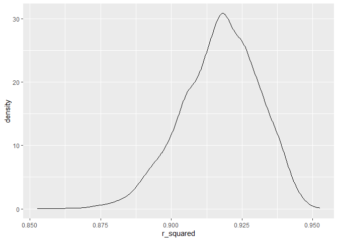
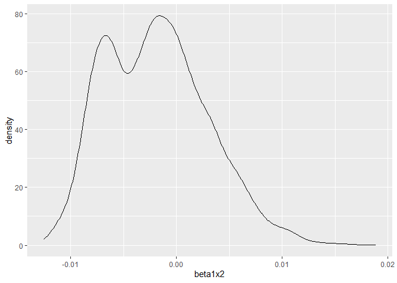
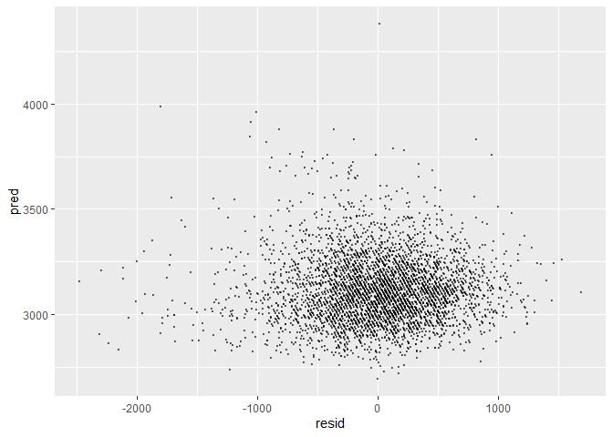
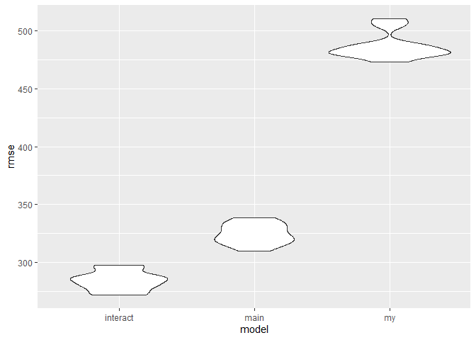

Homework 6
================
Lucia Wang (lw3061)

## Problem 1

Import and tidy homicides data as before:

``` r
homicide = 
  read_csv("homicide-data.csv") |> 
  janitor::clean_names() |>
  separate(reported_date, into=c("year","month","day"), sep=c(4,6)) |>
  mutate(city_state = str_c(city, ", ", state)) |>
  filter(!city_state %in% c("Dallas, TX", "Phoenix, AZ", "Kansas City, MO", "Tulsa, AL"))  |> 
  mutate(status = case_when(
    disposition %in% c("Closed without arrest","Open/No arrest") ~ "unsolved",
    disposition == "Closed by arrest" ~ "solved"
  )) |>
  filter(victim_race %in% c("White", "Black")) |>
  mutate(victim_age = as.numeric(victim_age),
         resolved = as.numeric(disposition == "Closed by arrest"),
         victim_race = fct_relevel(victim_race, "White"))
```

    ## Rows: 52179 Columns: 12
    ## ── Column specification ────────────────────────────────────────────────────────
    ## Delimiter: ","
    ## chr (9): uid, victim_last, victim_first, victim_race, victim_age, victim_sex...
    ## dbl (3): reported_date, lat, lon
    ## 
    ## ℹ Use `spec()` to retrieve the full column specification for this data.
    ## ℹ Specify the column types or set `show_col_types = FALSE` to quiet this message.

    ## Warning: There was 1 warning in `mutate()`.
    ## ℹ In argument: `victim_age = as.numeric(victim_age)`.
    ## Caused by warning:
    ## ! NAs introduced by coercion

Now to run a logistic regression on homicides vs age, sex, and race in
Baltimore, MD.

``` r
md_glm = homicide |> filter(city_state =="Baltimore, MD") |>
  glm(resolved ~ victim_age + victim_sex + victim_race, data=_, family=binomial())

md_or = md_glm |> broom::tidy() |>
  mutate(
    OR = exp(estimate),
    OR_low = exp(estimate - 1.96*std.error),
    OR_high = exp(estimate + 1.96*std.error)) |>
  select(term,OR, OR_low, OR_high)

md_or_sex = md_or |> filter(term=="victim_sexMale") 

md_or_sex|> knitr::kable()
```

| term           |        OR |   OR_low |   OR_high |
|:---------------|----------:|---------:|----------:|
| victim_sexMale | 0.4255117 | 0.324559 | 0.5578655 |

The adjusted OR for solving homicides comparing male victims to female
victims with others variables fixed is 0.43 with 95% confidence interval
of (0.32, 0.56). Male victims are 0.57 less likely to have their
homicide resolved than female victims adjusted for age and race.

Here I run the same regression using `glm` on all the cities in the
dataset:

``` r
all_cities = homicide |> nest(.by=city_state) |>
  mutate(
  models = map(data, 
               \(df) glm(resolved ~ victim_age + victim_sex + victim_race,
                         family=binomial(), data=df)),
  models = map(models, broom::tidy)
) |>
  select(-data) |>
  unnest(cols=models) |>
  mutate(
    OR = exp(estimate),
    OR_low = exp(estimate - 1.96*std.error),
    OR_high = exp(estimate + 1.96*std.error)) |>
  filter(term=="victim_sexMale") |>
  select(city_state, OR, OR_low, OR_high)
```

This is the plot of ORs and 95% CIs organized from least to greatest OR.

``` r
all_cities |> mutate(city_state=fct_reorder(city_state, OR)) |>
  ggplot(aes(x=city_state, y=OR)) +
  geom_point() +
  geom_errorbar(aes(ymin=OR_low, ymax=OR_high)) +
   theme(axis.text.x = element_text(angle = 90, hjust = 1))
```

<!-- -->

The smallest OR is in NYC with a value of 0.26, suggesting that male
victims are 0.74 less likely than females to have their homicide
resolved after adjusting for age and race. The highest OR is Albuquerque
with a value of 1.77. Since this is above 1, males are -0.77 times more
likely to have their homicides resolved. The CIs for the higher ORs
(around 1- above 1) are much wider than the ones with ORs below 1.

## Problem 2

First, download data:

``` r
weather_df = 
  rnoaa::meteo_pull_monitors(
    c("USW00094728"),
    var = c("PRCP", "TMIN", "TMAX"), 
    date_min = "2022-01-01",
    date_max = "2022-12-31") |>
  mutate(
    name = recode(id, USW00094728 = "CentralPark_NY"),
    tmin = tmin / 10,
    tmax = tmax / 10) |>
  select(name, id, everything())
```

    ## using cached file: C:\Users\wangl\AppData\Local/R/cache/R/rnoaa/noaa_ghcnd/USW00094728.dly

    ## date created (size, mb): 2023-09-28 10:19:41.358543 (8.541)

    ## file min/max dates: 1869-01-01 / 2023-09-30

The simple linear regression will have `tmax` as the response variable
with `tmin` and `prcp` as predictors. Run 5000 bootstraps and estimate
r-squared and log(beta1 x beta2) - which is log(beta1) x log(beta2),
then plot the distributions.

``` r
weather_bstrap = weather_df |>
  bootstrap(n=5000) |>
  mutate(models = map(strap, \(df) lm(tmax ~ tmin + prcp, data=df) ),
         results = map(models, broom::tidy),
         rsq = map(models, broom::glance)
         ) |>
  select(-strap, -models) |>
  unnest(results) |> 
  filter(term %in% c("tmin", "prcp")) |>
  group_by(.id) |> 
  mutate(beta1x2 = sum(estimate)) |>
  select(beta1x2, rsq) |> 
  unnest(rsq) |> 
  janitor::clean_names() |>
  select(id, beta1x2, r_squared) |> unique()
```

    ## Adding missing grouping variables: `.id`

``` r
weather_bstrap |> ggplot(aes(x=beta1x2)) + geom_density()
```

<!-- -->

The distribution of the log(beta1 \* beta2) estimates seems to be
centered around 1.01 with majority of values between 0.95 and 1.05.

``` r
weather_bstrap |> ggplot(aes(x=r_squared)) + geom_density()
```

<!-- -->

The distribution of the r-squared values is pretty high at around 0.92.
The bulk of the estimates fall approximately from 0.9 to 0.95 but skew
left (more higher values).

Now calculate the confidence intervals for the sampled log(beta1 \*
beta2) and r-squared values…

``` r
sum_weather = weather_bstrap |>
  unique() |> ungroup() |> select(-id) |> summarize(betas_mean = mean(beta1x2),
                                              betas_low = quantile(beta1x2, 0.025),
                                              betas_high = quantile(beta1x2, 0.975),
                                              rsq_mean = mean(r_squared),
                                              rsq_low = quantile(r_squared, 0.025),
                                              rsq_high = quantile(r_squared, 0.975))
 sum_weather |> knitr::kable()
```

| betas_mean | betas_low | betas_high | rsq_mean |   rsq_low |  rsq_high |
|-----------:|----------:|-----------:|---------:|----------:|----------:|
|   1.013222 | 0.9806883 |   1.043875 | 0.917522 | 0.8894198 | 0.9404794 |

After 5000 bootstraps, the 95% CI for the r-squared values is
(0.8894198, 0.9404794) and the CI for the log(beta1 \* beta2) values is
(0.9806883, 1.0438745).

## Problem 3

Import and tidy birthweight data:

``` r
bw = read_csv("birthweight.csv") |>
  mutate(babysex= as.factor(babysex),
         frace = as.factor(frace),
         malform = as.factor(malform),
         mrace = as.factor(mrace))
```

    ## Rows: 4342 Columns: 20
    ## ── Column specification ────────────────────────────────────────────────────────
    ## Delimiter: ","
    ## dbl (20): babysex, bhead, blength, bwt, delwt, fincome, frace, gaweeks, malf...
    ## 
    ## ℹ Use `spec()` to retrieve the full column specification for this data.
    ## ℹ Specify the column types or set `show_col_types = FALSE` to quiet this message.

My proposed regression model for birthweight will use mother’s weight at
delivery `delwt`, mother’s age at delivery `momage`, and mother’s age at
menarche `menarche` as predictors, with no interaction terms. I am
curious about these variables because they are related to reproductive
cycles of the mother so they would likely affect the development of the
fetus and thus the birthweight of the baby.

``` r
fit = lm(bwt ~ delwt + momage + menarche, data=bw)
fit |> broom::tidy() |> select(term, estimate, p.value) |> knitr::kable(digits=3)
```

| term        | estimate | p.value |
|:------------|---------:|--------:|
| (Intercept) | 1958.076 |   0.000 |
| delwt       |    6.393 |   0.000 |
| momage      |   15.722 |   0.000 |
| menarche    |   -7.471 |   0.144 |

At a quick glance the estimates have low p-values except for the
estimate for `menarche`. Now I will add residuals and fitted values…

``` r
bw |>
  modelr::add_residuals(fit) |>
  modelr::add_predictions(fit) |>
  ggplot(aes(x=resid, y=pred)) + geom_point(alpha=0.5, size=0.5)
```

<!-- -->

The plot of the fitted values and residuals is not looking very good;
there are some outliers and some clustering of values, so maybe the
linear model isn’t the best.

Now I’ll compare this to 2 other models using the cross-validation
method:

``` r
cv_df = crossv_mc(bw, 10)

cv_df = cv_df |>
  mutate(train = map(train, as_tibble),
         test = map(test, as_tibble)) 

cv_df = cv_df |>
  mutate(
    my_mod = map(train, \(df) lm(bwt ~ delwt + momage + menarche, data=df)),
    main_mod = map(train, \(df) lm(bwt ~ blength + gaweeks, data=df)),
    interact_mod = map(train, \(df) lm(bwt ~ bhead * blength * babysex, data=df))
    ) |>
  mutate(
    rmse_my = map2_dbl(my_mod, test, \(mod, df) rmse(model = mod, data = df)),
    rmse_main = map2_dbl(main_mod, test, \(mod, df) rmse(model = mod, data = df)),
    rmse_interact = map2_dbl(interact_mod, test, \(mod, df) rmse(model = mod, data = df))
    )

cv_df |> select(starts_with("rmse")) |>
  pivot_longer(
    everything(), names_to="model", values_to="rmse", names_prefix="rmse_"
  ) |>
  ggplot(aes(x=model, y=rmse)) + geom_violin()
```

<!-- -->

Based on looking at the root mean squared error, the model with the
interactions between `bhead`, `blength`, and `babysex` seems to be the
best fit as it has the smallest rmse. In contrast, the rmse for my model
is really much higher than the other two models, so it looks like it’s
not optimal.
